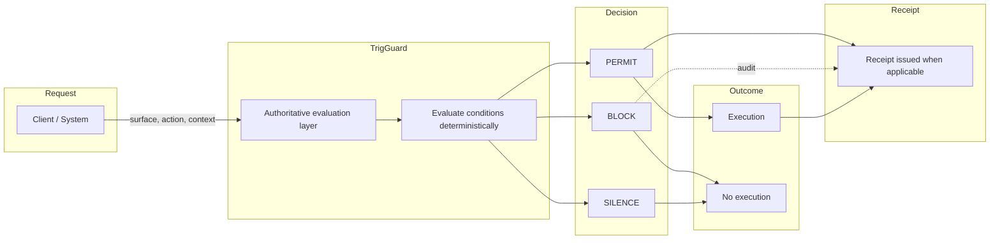
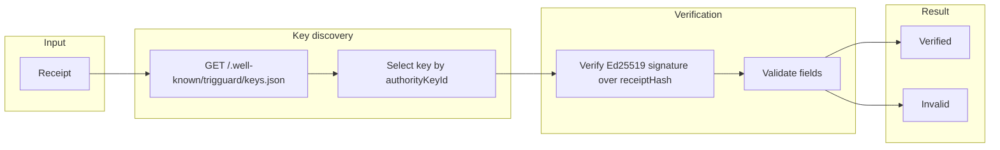
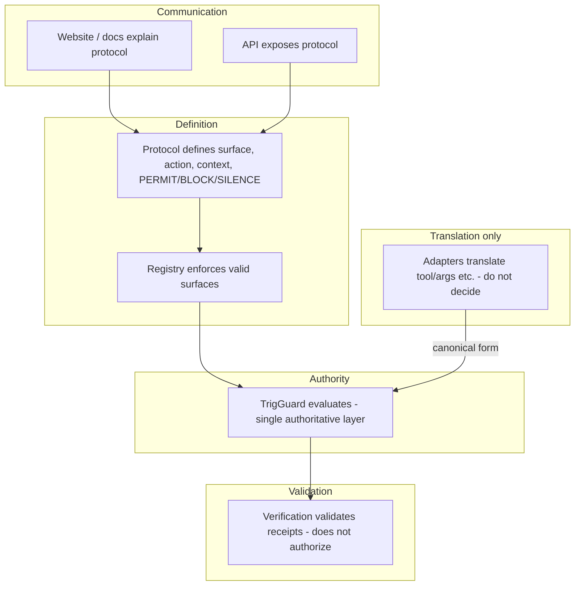
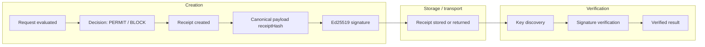

# TrigGuard Protocol Diagrams

**Version:** 1.0.0  
**Status:** Canonical — visual source of truth for execution, verification, authority, and receipt lifecycle  
**Audience:** Technical buyers, investors, security engineers, platform engineers, design/brand collaborators.

This document embeds and explains the protocol diagrams. Source files live in [diagrams/](diagrams/). All diagrams use the same canonical language and align with [TRIGGUARD_EXECUTION_PROTOCOL.md](TRIGGUARD_EXECUTION_PROTOCOL.md).

---

## 1. Execution flow

**Purpose:** Show how a request (surface, action, context) passes through the single authoritative evaluation layer, produces PERMIT/BLOCK/SILENCE, and leads to execution or no execution and optionally a receipt.

**Interpretation:** The client sends surface, action, context. TrigGuard evaluates once, deterministically. PERMIT allows execution and issues a receipt; BLOCK blocks execution (receipt may be issued for audit); SILENCE blocks execution with no receipt. Who decides: TrigGuard only. What gets blocked: execution whenever the decision is not PERMIT.

**Source:** [diagrams/execution-flow.mmd](diagrams/execution-flow.mmd)

---

## 2. Verification flow

**Purpose:** Show how a receipt is verified using key discovery and signature verification, without calling back to TrigGuard.

**Interpretation:** Verification is offline-capable. The verifier loads the receipt, fetches or uses cached keys from the well-known endpoint, selects the key by `authorityKeyId`, verifies the Ed25519 signature over the signed payload, and validates fields. Result is verified or invalid. No dependency on TrigGuard at verification time.

**Source:** [diagrams/verification-flow.mmd](diagrams/verification-flow.mmd)

---

## 3. Authority model

**Purpose:** Show that website and API explain/expose the protocol; protocol and registry define and enforce surfaces; TrigGuard is the single evaluator; adapters translate but do not decide; verification validates and does not authorize.

**Interpretation:** Authority is centralized in TrigGuard. Protocol and registry define the contract and valid surfaces; adapters feed the canonical form into that single layer. Verification only confirms receipts; it does not issue PERMITs. Adapters are explicitly separate from authority.

**Source:** [diagrams/authority-model.mmd](diagrams/authority-model.mmd)

---

## 4. Receipt lifecycle

**Purpose:** Show receipt creation (after evaluation), canonical payload and signature, storage/transport, and verification.

**Interpretation:** Receipts are created only for PERMIT (and optionally BLOCK for audit). The signed payload (receiptHash) and Ed25519 signature bind the decision. The receipt can then be stored or returned; later, any party can verify it via key discovery and signature check. Deterministic and non-magical: verification is algorithm and key-based.

**Source:** [diagrams/receipt-lifecycle.mmd](diagrams/receipt-lifecycle.mmd)

---

## 5. Site-alignment notes

These artifacts are the source of truth for protocol communication. Future site copy, protocol pages, and pitch materials should align to the same statements:

- **Execution is blocked unless conditions are explicitly satisfied.**
- **If TrigGuard cannot verify a decision, execution is blocked.**
- **The same conditions always produce the same outcome.** (Deterministic.)
- **There are no silent fallbacks, assumptions, or approximations.**
- **All execution decisions originate from a single authoritative evaluation layer.**

Do not redesign the site or change UI in this package. These notes inform messaging only: one visual and narrative model across docs, pitch, and future site copy.

---

## 6. Diagram quality rules

Diagrams in this directory are:

- **Minimal** — Only nodes and edges needed to convey the flow.
- **Precise** — Canonical terms only (PERMIT, BLOCK, SILENCE; surface, action, context; authoritative evaluation layer; fail-closed; deterministic; verifiable).
- **Serious** — Infrastructure-grade; no decorative complexity or fluffy labels.
- **Reusable** — Mermaid source (`.mmd`) can be used in docs, Notion, Confluence, or exported to SVG/PNG for product materials.

Avoid: legacy deny-class decision labels (use **BLOCK**), “AI decides,” “smart system,” probabilistic or assistant-like language, unexplained jargon.

---

## References

| Document | Purpose |
|----------|---------|
| [TRIGGUARD_EXECUTION_PROTOCOL.md](TRIGGUARD_EXECUTION_PROTOCOL.md) | Canonical execution contract |
| [TRIGGUARD_EXECUTION_FLOW.md](TRIGGUARD_EXECUTION_FLOW.md) | Execution flow narrative |
| [TRIGGUARD_VERIFICATION_FLOW.md](TRIGGUARD_VERIFICATION_FLOW.md) | Verification flow narrative |
| [TRIGGUARD_AUTHORITY_MODEL.md](TRIGGUARD_AUTHORITY_MODEL.md) | Authority and trust model |
| [diagrams/](diagrams/) | Mermaid source (`.mmd`) for all diagrams |
